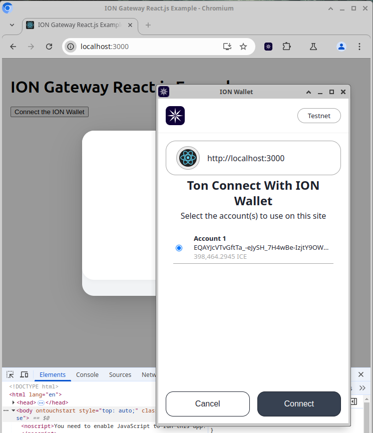
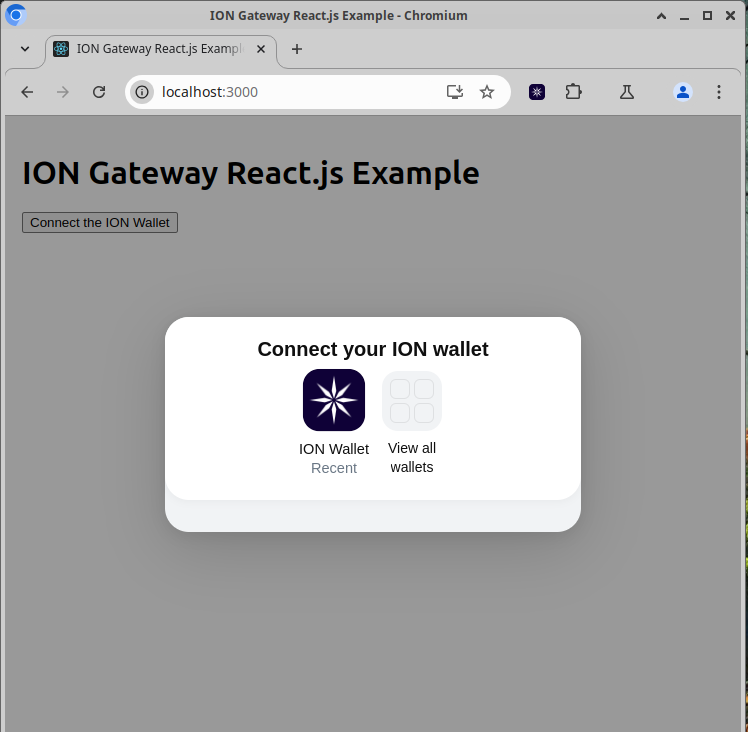
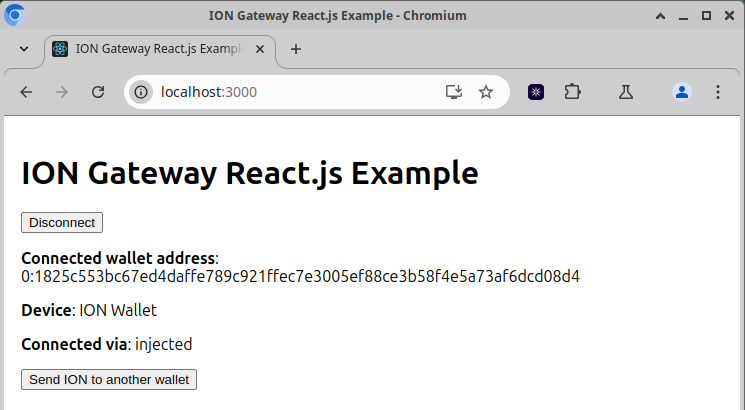
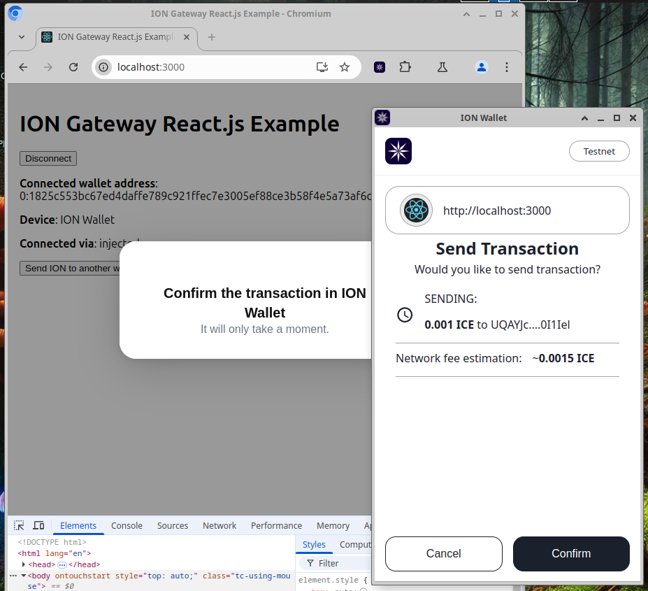

# ION Gateway Developer Manual - React.js Example 
> The `ION Gateway React.js Example` demonstrates, how to use the `ION Gateway` for connecting custom Web3 applications to the `ION Blockchain` using one of the `ION Wallets` supporting the `ION Gateway` protocol.

## Installing the `ION Gateway`
```shell
git clone https://github.com/ice-blockchain/ion-gateway.git
./build.sh
```
The `build.sh` script prepares a multi-package JavaScript/TypeScript project for development. When run, it installs all dependencies, builds each component package, and registers them to a local Yarn registry with `yarn link --register`. This allows the developer to work with the entire project ecosystem using locally linked packages rather than published versions, creating a seamless development environment with all components available through the local registry.


## Screenshots

### Connecting the wallet to a Web3 App




### Wallet details


### Sending ION to another wallet

