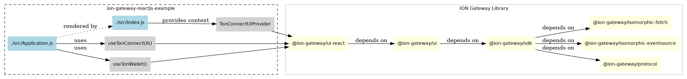

# ION Gateway Developer Manual - React.js Example 
> The `ION Gateway React.js Example` demonstrates, how to use the `ION Gateway` for connecting custom Web3 applications to the `ION Blockchain` using one of the `ION Wallets` supporting the `ION Gateway` protocol.


[(original *.dot)](./components.dot)

- The `ion-gateway-reactjs-example` uses React Provider (`TonConnectUIProvider`) from `@ion-gateway/ui-react` to establish context.
- Hooks (`useTonConnectUI` and `useTonWallet`) from `@ion-gateway/ui-react` provide functionalities to React components in this project.
- Underlying libraries (`@ion-gateway/ui`, `@ion-gateway/sdk`, `@ion-gateway/protocol`) provide lower-level functionality, API interactions, context management, protocol definitions, and network layer (`isomorphic-fetch`, `isomorphic-eventsource`).
- Local linking (`yarn link`) is used during development, as indicated by the provided scripts.

## The Wallets file
The ION Gateway wallets configuration is maintained in a publicly accessible JSON file at [https://raw.githubusercontent.com/ice-blockchain/wallets-list/refs/heads/master/wallets-v2.json](https://raw.githubusercontent.com/ice-blockchain/wallets-list/refs/heads/master/wallets-v2.json). 

This file currently defines a single wallet entry for "ION Wallet". The wallet integrates via a JavaScript bridge using the key "ion" and is currently available on the Chrome platform. For more information about the ION Wallet, visit [https://ice.io/](https://ice.io/).

## Installing the `ION Gateway`

> Please, get sure to have the latest `Node.js` and `Yarn` installed.

```shell
git clone https://github.com/ice-blockchain/ion-gateway.git
cd ion-gateway
./build.sh
```
The `build.sh` script prepares a multi-package JavaScript/TypeScript project for development. When run, it installs all dependencies, builds each component package, and registers them to a local Yarn registry with `yarn link --register`. This allows the developer to work with the entire project ecosystem using locally linked packages rather than published versions, creating a seamless development environment with all components available through the local registry.

## Installing the `ION Gateway React.js Example`

> Please, get sure to have the latest `Node.js` and `Yarn` installed.

```shell
git clone https://github.com/ice-blockchain/ion-gateway-reactjs-example.git
cd ion-gateway-reactjs-example
./build.sh
```

## OR - Installing both

> Please, get sure to have the latest `Node.js` and `Yarn` installed.

```shell
git clone https://github.com/ice-blockchain/ion-gateway.git
cd ion-gateway
./build.sh

cd ..

git clone https://github.com/ice-blockchain/ion-gateway-reactjs-example.git
cd ion-gateway-reactjs-example
./build.sh

cd ..
```

## ION Gateway React.js Example Playground
- http://217.79.254.147:3013/

## Screenshots

### Connecting the wallet to a Web3 App


### Wallet details


### Sending ION to another wallet


## Running the example using PM2
```shell
pm2 start "PORT=3013 HOST=0.0.0.0 npm run start" --name "gateway-example"
```

